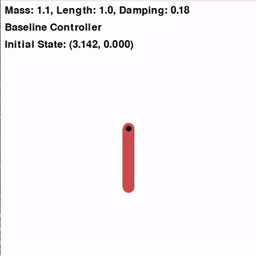
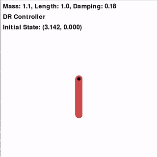
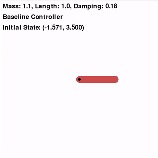
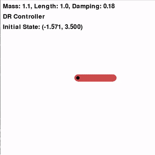
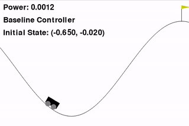
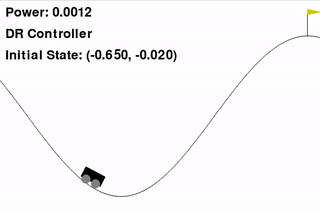

Distributionally Robust Lyapunov-stable Policy Learning
========================================================================
This repository contains code for the work "Distributionally Robust Policy and Lyapunov-Certificate Learning".

# Clone Repo
```bash
git clone https://github.com/KehanLong/DR_Stabilizing_Policy
```
# Dependencies

Install the required dependcies by using a anaconda virtual environment:
```
conda env create -f environment.yml
```

## Acknowledgments

This project uses a modified version of the Gymnasium library, which is an open-source library for developing and comparing reinforcement learning algorithms. We would like to acknowledge the original work by the Farama Foundation and the contributors of the Gymnasium repository. The original repository can be found at https://github.com/Farama-Foundation/Gymnasium.

The Gymnasium_modified directory in this project contains a few minor modifications to the system dynamics of the Mountain Car and Inverted Pendulum environments. 

Activate the environment:
```
conda activate DR_Stabilizing_Policy
```

and go to the project directory
```
cd DR_LF_Learning
```

# Training

To re-train the provided examples, simply run
```python Inverted_pendulum_learning.py``` or ```python mountain_car_learning.py```

Pre-trained models are available in the saved_models/joint_clf_controller_models directory.

To reproduce the results, refer to the files ```Inverted_pendulum_evaluate```; ```Mountain_car_evaluate```. 


# Results

The results of the learned DR Lyapunov-stable policy are demonstrated through the following GIFs:

## Inverted Pendulum

### Initial state 1

| Baseline | Distributionally Robust |
|:--------:|:-----------------------:|
|  |  |

### Initial state 2

| Baseline | Distributionally Robust |
|:--------:|:-----------------------:|
|  |  |

## Mountain Car

| Baseline | Distributionally Robust |
|:--------:|:-----------------------:|
|  |  |

